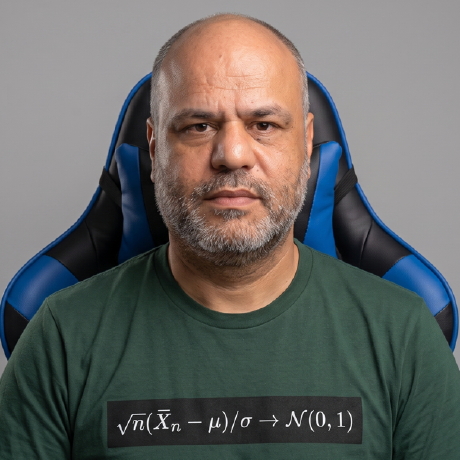

## À propos de moi

{width=200px fig-align="center"}

### Présentation

Bonjour ! Je suis **Khemais Abdallah**, enseignant et chercheur en intelligence artificielle, passionné par la modélisation mathématique et l'analyse de données.

#### Mes compétences

- **R & Statistiques** : Modélisation, Tidyverse, visualisation de données, Shiny
- **Python & IA** : Deep Learning, architectures de graphes de calcul, Machine Learning
- **Mathématiques & Recherche** : Algèbre linéaire, optimisation, interprétabilité des modèles

### Expériences

- 💼 **Expérience** : Enseignant ,chercheur et Consultatnt IT 
- 🎓 **Recherche** : Interprétabilité mécanistique des modèles de deep learning et architectures de calcul réactif

---

## Mes Cours

Choisissez un cours pour commencer :

::: {.grid}

::: {.g-col-6}
### Cours R
{width=100px}

Apprenez R avec des exemples interactifs utilisant WebR.

[Accéder au cours R →](cours-r.qmd){.btn .btn-primary}
:::

::: {.g-col-6}
### Cours Python
{width=200px}

Maîtrisez Python avec des exercices interactifs utilisant Pyodide.

[Accéder au cours Python →](cours-python.qmd){.btn .btn-primary}
:::

:::

---

## Contact & Liens

📧 **Email** : [abdallah.khemais@gmail.com](mailto:abdallah.khemais@gmail.com)  
💼 **LinkedIn** : [khemais-abdallah](https://www.linkedin.com/in/khemais-abdallah/)  
💻 **GitHub** : [nevermind78](https://github.com/nevermind78)  
🎓 **Google Scholar** : [Profil de recherche](https://scholar.google.com/citations?hl=fr&user=J1z5cOgAAAAJ)